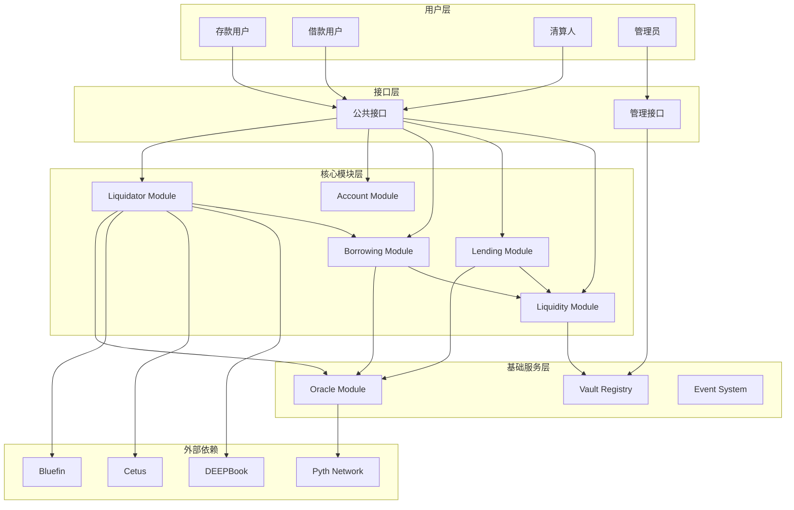
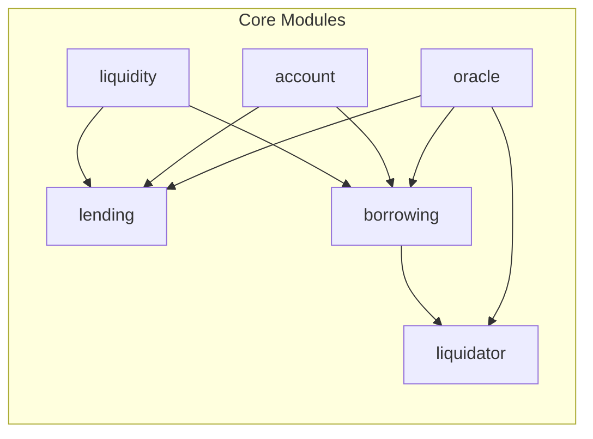

# Olend DeFi 借贷平台设计文档

## 概述

Olend 是一个基于 Sui Network 的去中心化借贷平台，采用统一流动性管理和高效清算机制。本设计文档基于需求文档，详细描述了系统的技术架构、数据模型和组件设计。

### 核心设计原则

1. **统一流动性**: 每种资产只有一个全局 Vault，最大化资本效率
2. **模块化架构**: 清晰的模块边界，便于维护和升级
3. **安全优先**: 多层安全机制，包括权限控制、暂停机制和风险管理
4. **高性能**: 利用 Sui 的并行执行能力，优化 gas 消耗
5. **可扩展性**: 支持新资产类型和功能模块的动态添加

## 系统架构

### 整体架构图



### 模块依赖关系



## 数据模型设计

### 核心数据结构

#### 1. Liquidity Module

```move
// 全局资产注册表
struct Registry has key {
    id: UID,
    vaults: Table<TypeName, ID>,  // 资产类型 -> Vault ID
    admin_cap: ID,                // AdminCap 对象 ID
    paused: bool,                 // 全局暂停状态
}

// 管理员权限凭证
struct AdminCap has key {
    id: UID,
}

// 统一流动性金库
struct Vault<phantom T> has key {
    id: UID,
    balance: Balance<T>,          // 资产余额
    total_shares: u64,            // 总份额数
    
    // 状态控制
    paused: bool,                 // 暂停状态
    
    // 每日限额控制
    daily_withdraw_limit: u64,    // 每日提取限额
    daily_withdrawn: u64,         // 当日已提取金额
    last_reset_day: u64,          // 上次重置日期
    
    // ERC-4626 兼容
    asset_per_share: u128,        // 每份额对应的资产数量 (scaled by 1e18)
    
    // 统计信息
    total_deposits: u64,          // 累计存款
    total_borrows: u64,           // 累计借款
    
    // 事件记录
    created_at: u64,
}
```

#### 2. Lending Module

```move
// 借贷池
struct LendingPool<phantom T> has key {
    id: UID,
    vault_id: ID,                 // 关联的 Vault ID
    
    // 利息模型
    interest_rate_model: InterestRateModel,
    last_update_time: u64,
    accumulated_interest_index: u128,  // 累计利息指数
    
    // 池子状态
    total_deposits: u64,
    reserve_factor: u64,          // 储备金率 (basis points)
    
    // 限制参数
    deposit_cap: u64,             // 存款上限
    min_deposit: u64,             // 最小存款金额
    min_withdraw: u64,            // 最小提取金额
    
    // 大额操作控制
    large_withdraw_threshold: u64, // 大额提取阈值
    withdraw_delay: u64,          // 提取延迟时间
}

// 利息率模型
struct InterestRateModel has store {
    base_rate: u64,               // 基础利率 (basis points)
    multiplier: u64,              // 利率乘数
    jump_multiplier: u64,         // 跳跃乘数
    kink: u64,                    // 拐点利用率
}

// 存款凭证
struct YToken<phantom T> has key, store {
    id: UID,
    shares: u64,                  // 份额数量
    pool_id: ID,                  // 所属池子 ID
    minted_at: u64,               // 铸造时间
}
```

#### 3. Borrowing Module

```move
// 借款池
struct BorrowingPool<phantom T> has key {
    id: UID,
    collateral_type: TypeName,    // 抵押物类型
    borrow_asset_type: TypeName,  // 借款资产类型
    
    // 风险参数
    collateral_factor: u64,       // 抵押率 (basis points)
    liquidation_threshold: u64,   // 清算阈值
    liquidation_penalty: u64,     // 清算罚金
    
    // 利率配置
    interest_type: InterestType,  // Dynamic | Fixed
    interest_rate: u64,           // 固定利率 (如适用)
    rate_locked: bool,            // 利率是否锁定
    
    // 期限配置
    term_type: TermType,          // Perpetual | Fixed
    term_duration: Option<u64>,   // 期限长度 (如适用)
    
    // 头寸管理
    positions_by_ltv: Table<u64, vector<ID>>, // LTV -> Position IDs
    total_positions: u64,
    
    // 借款限制
    min_borrow: u64,              // 最小借款金额
    max_borrow_per_user: u64,     // 单用户最大借款
    total_borrow_cap: u64,        // 总借款上限
    
    // 费用配置
    origination_fee: u64,         // 开仓费 (basis points)
    late_fee: u64,                // 逾期费
    
    // 统计信息
    total_borrowed: u64,
    total_collateral: u64,
    created_at: u64,
}

// 利率类型
struct InterestType has store {
    variant: u8, // 0: Dynamic, 1: Fixed
}

// 期限类型
struct TermType has store {
    variant: u8, // 0: Perpetual, 1: Fixed
}

// 借款头寸
struct Position has key {
    id: UID,
    borrower: address,
    pool_id: ID,
    
    // 抵押物信息
    collateral_tokens: vector<YToken<SUI>>, // 抵押的 YToken
    collateral_value: u64,        // 抵押物价值 (USD)
    
    // 借款信息
    borrowed_amount: u64,         // 借款金额
    borrowed_asset_type: TypeName,
    
    // 利息计算
    interest_index: u128,         // 借款时的利息指数
    last_interest_update: u64,    // 上次利息更新时间
    accrued_interest: u64,        // 累计利息
    
    // 状态信息
    health_factor: u128,          // 健康因子
    ltv_ratio: u64,               // 贷款价值比
    
    // 时间信息
    created_at: u64,
    maturity: Option<u64>,        // 到期时间 (如适用)
    last_payment: u64,            // 上次还款时间
    
    // 状态标记
    is_liquidatable: bool,        // 是否可清算
    is_defaulted: bool,           // 是否违约
}
```

#### 4. Account Module

```move
// 账户注册表
struct AccountRegistry has key {
    id: UID,
    accounts: Table<address, ID>, // 用户地址 -> Account ID
    total_users: u64,
}

// 用户账户
struct Account has key {
    id: UID,
    owner: address,
    
    // 用户等级系统
    level: UserLevel,
    points: u64,                  // 积分
    tier_benefits: TierBenefits,  // 等级权益
    
    // 头寸追踪
    lending_positions: vector<ID>, // 存款头寸
    borrowing_positions: vector<ID>, // 借款头寸
    
    // 统计信息
    total_deposits: u64,          // 累计存款
    total_borrows: u64,           // 累计借款
    total_interest_earned: u64,   // 累计利息收入
    total_interest_paid: u64,     // 累计利息支出
    
    // 风险信息
    total_collateral_value: u64,  // 总抵押物价值
    total_debt_value: u64,        // 总债务价值
    overall_health_factor: u128,  // 整体健康因子
    
    // 状态信息
    is_active: bool,              // 是否活跃
    last_activity: u64,           // 上次活动时间
    created_at: u64,
}

// 用户等级
struct UserLevel has store {
    tier: u8,                     // 0: Bronze, 1: Silver, 2: Gold, 3: Platinum, 4: VIP
    name: String,
}

// 等级权益
struct TierBenefits has store {
    fee_discount: u64,            // 手续费折扣 (basis points)
    borrow_limit_multiplier: u64, // 借款限额倍数
    priority_support: bool,       // 优先客服
    early_access: bool,           // 新功能早期访问
}

// 账户权限凭证
struct AccountCap has key {
    id: UID,
    account_id: ID,
}
```

#### 5. Oracle Module

```move
// 价格数据
struct PriceData has store {
    price: u64,                   // 价格 (scaled by 1e8)
    confidence: u64,              // 置信度
    timestamp: u64,               // 时间戳
    source: String,               // 数据源
}

// 价格聚合器
struct PriceAggregator<phantom T> has key {
    id: UID,
    asset_type: TypeName,
    
    // 价格数据
    current_price: PriceData,
    twap_price: u64,              // 时间加权平均价格
    twap_window: u64,             // TWAP 窗口大小
    
    // 价格历史
    price_history: vector<PriceData>,
    max_history_size: u64,
    
    // 异常检测
    max_price_deviation: u64,     // 最大价格偏差 (basis points)
    price_staleness_threshold: u64, // 价格过期阈值
    
    // 多源配置
    primary_source: String,       // 主要数据源
    backup_sources: vector<String>, // 备用数据源
    
    // 状态信息
    is_active: bool,
    last_update: u64,
}
```

#### 6. Liquidator Module

```move
// 清算 Tick
struct LiquidationTick has key {
    id: UID,
    ltv_threshold: u64,           // LTV 阈值
    positions: vector<ID>,        // 该阈值下的头寸
    total_collateral: u64,        // 总抵押物价值
    total_debt: u64,              // 总债务价值
    
    // 批量清算参数
    batch_size: u64,              // 批量大小
    liquidation_penalty: u64,     // 清算罚金
    
    // 状态信息
    is_active: bool,
    last_update: u64,
}

// 清算记录
struct LiquidationRecord has key {
    id: UID,
    position_id: ID,
    liquidator: address,
    
    // 清算详情
    collateral_seized: u64,       // 扣押的抵押物
    debt_repaid: u64,             // 偿还的债务
    liquidation_reward: u64,      // 清算奖励
    
    // 价格信息
    collateral_price: u64,        // 清算时抵押物价格
    debt_price: u64,              // 清算时债务价格
    
    // DEX 交易信息
    dex_used: String,             // 使用的 DEX
    swap_amount_in: u64,          // 输入金额
    swap_amount_out: u64,         // 输出金额
    slippage: u64,                // 滑点
    
    // 时间信息
    liquidated_at: u64,
}

// DEX 路由器
struct DexRouter has key {
    id: UID,
    
    // 支持的 DEX
    supported_dexes: vector<String>, // ["deepbook", "cetus", "bluefin"]
    
    // 路由配置
    default_dex: String,
    slippage_tolerance: u64,      // 滑点容忍度
    
    // 流动性监控
    liquidity_thresholds: Table<String, u64>, // DEX -> 最小流动性
    
    // 性能统计
    dex_performance: Table<String, DexStats>, // DEX 性能统计
}

struct DexStats has store {
    total_volume: u64,            // 总交易量
    average_slippage: u64,        // 平均滑点
    success_rate: u64,            // 成功率
    average_gas_cost: u64,        // 平均 gas 成本
}
```

## 组件接口设计

### 1. Liquidity Module 接口

```move
module olend::liquidity {
    // 管理接口
    public fun create_vault<T>(
        registry: &mut Registry,
        admin_cap: &AdminCap,
        ctx: &mut TxContext
    ): ID;
    
    public fun pause_vault<T>(
        vault: &mut Vault<T>,
        admin_cap: &AdminCap
    );
    
    public fun set_daily_limit<T>(
        vault: &mut Vault<T>,
        admin_cap: &AdminCap,
        limit: u64
    );
    
    // 核心操作 (package 内部使用)
    public(package) fun deposit<T>(
        vault: &mut Vault<T>,
        asset: Coin<T>,
        ctx: &mut TxContext
    ): u64; // 返回份额数量
    
    public(package) fun withdraw<T>(
        vault: &mut Vault<T>,
        shares: u64,
        ctx: &mut TxContext
    ): Coin<T>;
    
    public(package) fun borrow<T>(
        vault: &mut Vault<T>,
        amount: u64,
        ctx: &mut TxContext
    ): Coin<T>;
    
    public(package) fun repay<T>(
        vault: &mut Vault<T>,
        repayment: Coin<T>
    ): u64; // 返回实际还款金额
    
    // 查询接口
    public fun get_vault_info<T>(vault: &Vault<T>): (u64, u64, u64); // (balance, shares, rate)
    public fun calculate_shares<T>(vault: &Vault<T>, amount: u64): u64;
    public fun calculate_assets<T>(vault: &Vault<T>, shares: u64): u64;
}
```

### 2. Lending Module 接口

```move
module olend::lending {
    // 用户接口
    public fun deposit<T>(
        pool: &mut LendingPool<T>,
        vault: &mut Vault<T>,
        asset: Coin<T>,
        account: &mut Account,
        ctx: &mut TxContext
    ): YToken<T>;
    
    public fun withdraw<T>(
        pool: &mut LendingPool<T>,
        vault: &mut Vault<T>,
        ytoken: YToken<T>,
        account: &mut Account,
        ctx: &mut TxContext
    ): Coin<T>;
    
    // 管理接口
    public fun create_lending_pool<T>(
        admin_cap: &AdminCap,
        vault_id: ID,
        interest_model: InterestRateModel,
        ctx: &mut TxContext
    ): ID;
    
    public fun update_interest_rate<T>(
        pool: &mut LendingPool<T>,
        admin_cap: &AdminCap
    );
    
    // 查询接口
    public fun get_pool_info<T>(pool: &LendingPool<T>): (u64, u64, u64); // (deposits, rate, utilization)
    public fun calculate_interest<T>(pool: &LendingPool<T>, amount: u64, duration: u64): u64;
}
```

### 3. Borrowing Module 接口

```move
module olend::borrowing {
    // 用户接口
    public fun borrow<T, C>(
        pool: &mut BorrowingPool<T>,
        vault: &mut Vault<T>,
        collateral: vector<YToken<C>>,
        amount: u64,
        account: &mut Account,
        price_aggregator: &PriceAggregator<C>,
        ctx: &mut TxContext
    ): (Coin<T>, ID); // 返回借款和头寸 ID
    
    public fun repay<T>(
        pool: &mut BorrowingPool<T>,
        vault: &mut Vault<T>,
        position: &mut Position,
        repayment: Coin<T>,
        account: &mut Account,
        ctx: &mut TxContext
    ): vector<YToken<SUI>>; // 返回释放的抵押物
    
    // 管理接口
    public fun create_borrowing_pool<T>(
        admin_cap: &AdminCap,
        collateral_type: TypeName,
        config: BorrowingPoolConfig,
        ctx: &mut TxContext
    ): ID;
    
    public fun update_risk_parameters<T>(
        pool: &mut BorrowingPool<T>,
        admin_cap: &AdminCap,
        collateral_factor: u64,
        liquidation_threshold: u64
    );
    
    // 查询接口
    public fun get_position_health(position: &Position, price: u64): (u128, u64, bool); // (health, ltv, liquidatable)
    public fun calculate_max_borrow(collateral_value: u64, collateral_factor: u64): u64;
}
```

### 4. Liquidator Module 接口

```move
module olend::liquidator {
    // 清算接口
    public fun liquidate_position<T, C>(
        pool: &mut BorrowingPool<T>,
        vault_borrow: &mut Vault<T>,
        vault_collateral: &mut Vault<C>,
        position: &mut Position,
        liquidation_amount: u64,
        dex_router: &mut DexRouter,
        price_aggregator_collateral: &PriceAggregator<C>,
        price_aggregator_debt: &PriceAggregator<T>,
        ctx: &mut TxContext
    ): Coin<T>; // 返回清算奖励
    
    public fun batch_liquidate<T, C>(
        tick: &mut LiquidationTick,
        pool: &mut BorrowingPool<T>,
        vault_borrow: &mut Vault<T>,
        vault_collateral: &mut Vault<C>,
        dex_router: &mut DexRouter,
        ctx: &mut TxContext
    ): vector<LiquidationRecord>;
    
    // 查询接口
    public fun get_liquidatable_positions<T>(
        pool: &BorrowingPool<T>,
        price: u64
    ): vector<ID>;
    
    public fun calculate_liquidation_reward(
        collateral_value: u64,
        debt_value: u64,
        penalty: u64
    ): u64;
}
```

## 错误处理

### 错误码定义

```move
module olend::errors {
    // 通用错误 (1000-1099)
    const E_INSUFFICIENT_BALANCE: u64 = 1001;
    const E_INVALID_AMOUNT: u64 = 1002;
    const E_UNAUTHORIZED: u64 = 1003;
    const E_PAUSED: u64 = 1004;
    const E_INVALID_PARAMETER: u64 = 1005;
    
    // Vault 错误 (1100-1199)
    const E_VAULT_NOT_FOUND: u64 = 1101;
    const E_DAILY_LIMIT_EXCEEDED: u64 = 1102;
    const E_VAULT_PAUSED: u64 = 1103;
    const E_INSUFFICIENT_LIQUIDITY: u64 = 1104;
    
    // Lending 错误 (1200-1299)
    const E_POOL_NOT_FOUND: u64 = 1201;
    const E_DEPOSIT_CAP_EXCEEDED: u64 = 1202;
    const E_BELOW_MIN_DEPOSIT: u64 = 1203;
    const E_BELOW_MIN_WITHDRAW: u64 = 1204;
    const E_YTOKEN_COLLATERALIZED: u64 = 1205;
    
    // Borrowing 错误 (1300-1399)
    const E_INSUFFICIENT_COLLATERAL: u64 = 1301;
    const E_EXCEEDS_BORROW_LIMIT: u64 = 1302;
    const E_POSITION_NOT_FOUND: u64 = 1303;
    const E_POSITION_HEALTHY: u64 = 1304;
    const E_RATE_LOCKED: u64 = 1305;
    const E_LOAN_MATURED: u64 = 1306;
    
    // Oracle 错误 (1400-1499)
    const E_STALE_PRICE: u64 = 1401;
    const E_PRICE_DEVIATION_TOO_HIGH: u64 = 1402;
    const E_ORACLE_NOT_FOUND: u64 = 1403;
    const E_LOW_CONFIDENCE: u64 = 1404;
    
    // Liquidation 错误 (1500-1599)
    const E_POSITION_NOT_LIQUIDATABLE: u64 = 1501;
    const E_LIQUIDATION_FAILED: u64 = 1502;
    const E_INSUFFICIENT_DEX_LIQUIDITY: u64 = 1503;
    const E_SLIPPAGE_TOO_HIGH: u64 = 1504;
}
```

## 测试策略

### 单元测试

1. **Vault 操作测试**
   - 存款/提取功能
   - 份额计算准确性
   - 每日限额控制
   - 暂停机制

2. **利息计算测试**
   - 复利计算准确性
   - 利率模型验证
   - 时间相关计算

3. **风险管理测试**
   - 抵押率计算
   - 健康因子更新
   - 清算条件判断

### 集成测试

1. **端到端流程测试**
   - 完整的存款-借款-还款流程
   - 清算流程测试
   - 多用户并发操作

2. **预言机集成测试**
   - 价格数据获取和验证
   - 异常价格处理
   - 多源价格聚合

3. **DEX 集成测试**
   - 清算时的资产兑换
   - 滑点控制
   - 路由优化

### 压力测试

1. **高并发测试**
   - 大量用户同时操作
   - 系统性能瓶颈识别
   - Gas 消耗优化

2. **极端市场条件测试**
   - 价格剧烈波动
   - 大规模清算
   - 流动性枯竭

## 部署策略

### 分阶段部署

1. **Phase 1: 核心功能**
   - Liquidity + Lending 模块
   - 基础 Oracle 集成
   - SUI 资产支持

2. **Phase 2: 借贷功能**
   - Borrowing 模块
   - Account 管理
   - 基础清算机制

3. **Phase 3: 高级功能**
   - 高级清算机制
   - 多 DEX 集成
   - 用户等级系统

### 升级机制

1. **合约升级**
   - 使用 Sui 的包升级机制
   - 向后兼容性保证
   - 数据迁移策略

2. **参数调整**
   - 通过 AdminCap 进行参数更新
   - 时间锁保护重要变更
   - 社区治理集成

这个设计文档提供了 Olend 平台的完整技术架构。接下来我们可以基于这个设计创建详细的实现任务列表。